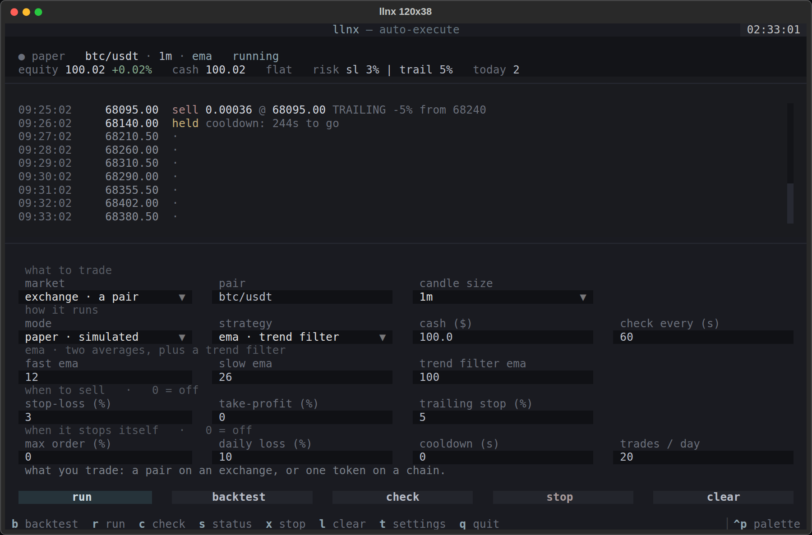
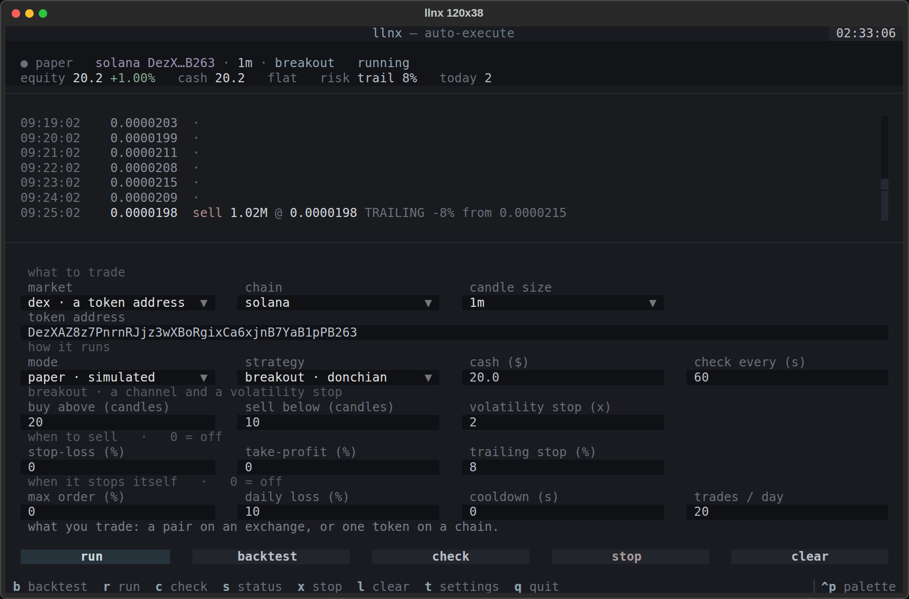
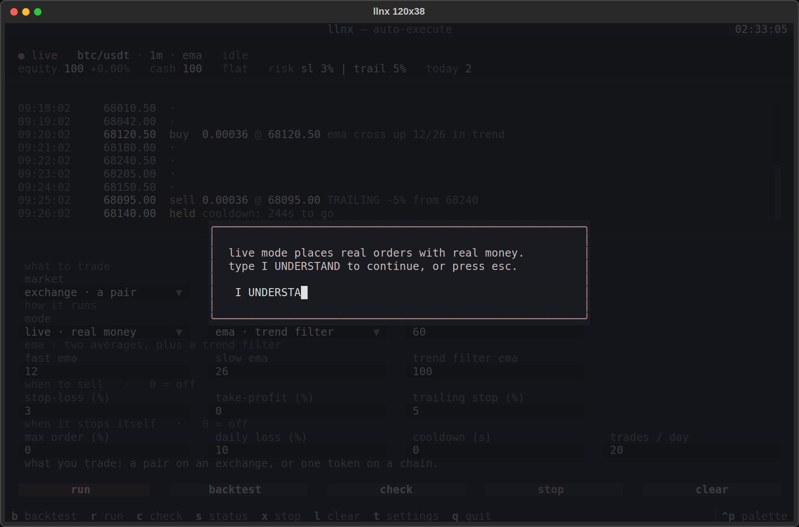
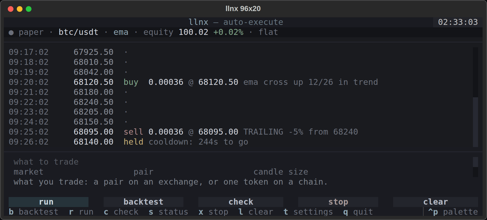
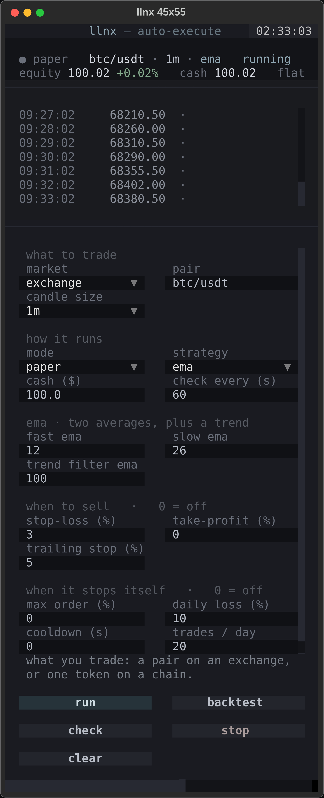

# llnx — a crypto bot that places its own orders

**llnx** watches a market, decides, and then actually sends the order. Paper,
exchange sandbox or real money — same loop, same code, one setting apart. It
ships with a TUI, a text menu and a CLI, and the core runs on the Python
standard library alone.

```bash
pip install textual
python3 main.py                     # TUI: pick a mode, press run
```

> **About tiny accounts.** $5–$20 is practice money, not a money machine. Fees
> (~0.1% per side), spread and exchange minimums (~$5–10) eat most of the
> profit at that size. Test on paper first, and never trade money you cannot
> afford to lose.

## The three modes

| mode | what happens | what you need |
|---|---|---|
| `paper` | real prices, simulated orders against a virtual balance | nothing |
| `sandbox` | exchange testnet orders, or a Solana dry run on real Jupiter quotes | testnet keys (CEX) |
| `live` | **real orders, real money** | API keys / a funded wallet |

```bash
python3 main.py run --mode paper
python3 main.py run --mode sandbox
python3 main.py run --mode live            # asks you to type I UNDERSTAND
```

Nothing goes out until you pick a non-paper mode, and live mode always asks
for the phrase — in the TUI, the menu and the CLI alike.

## How an order actually gets placed

```
feed → strategy → decision → risk (SL/TP) → guardrails → broker → venue
                                                 │           │
                                                 │           └─ real fill: amount,
                                                 │              price and fee come
                                                 │              back from the venue
                                                 └─ orders.jsonl: every attempt,
                                                    filled, blocked or failed
```

* **The fill is read back, never assumed.** On an exchange the order is polled
  until it is closed and the booked price is the average fill price, with the
  fee converted to the quote currency. On Solana the price comes from the
  Jupiter quote itself, and the swap is **confirmed on chain** before it is
  booked as a trade — an unconfirmed swap is not a trade.
* **Balances come from the venue.** After every live order — and after every
  failure — llnx re-reads the balance instead of guessing. A restart hands the
  average entry price back to the broker so the stop-loss still has something
  to measure against.
* **A failed order is never blindly retried.** A market order that errored may
  still have reached the venue; the next tick decides again with fresh prices.

## Guardrails

An auto-executing bot needs a hand on the brake. All of these live in
`config.yaml` and are checked before every order (0 = off):

| setting | what it does |
|---|---|
| `max_daily_loss_pct` | stops **buying** after -X% on the day; exits still work |
| `max_trades_per_day` | caps how many trades a day it may make |
| `cooldown_sec` | minimum seconds between orders |
| `max_order_pct` | shrinks any order bigger than X% of equity |
| `max_consecutive_failures` | stands the bot down after N failed orders in a row |
| `kill_switch_file` | the file that stops everything |

Exits are deliberately not blocked by the risk limits: after a bad day the
stop-loss is the last thing you want disabled. The kill switch and the failure
halt stop everything, because at that point the venue or your intent says so.

### The kill switch

```bash
python3 main.py stop      # creates STOP; a running bot quits within one tick
python3 main.py resume    # removes it
```

Works from any terminal, over SSH, from your phone — the running bot checks the
file every tick.

### Signals only

Want the old behaviour back for a while? `auto_execute: false`, or:

```bash
python3 main.py run --signals-only
```
Everything runs and gets journalled, nothing is sent.

## What it did while you were away

Every order attempt is appended to `orders.jsonl` — filled, blocked, rejected
or failed, with the signal that caused it:

```bash
python3 main.py status --orders 20
```
```
last 3 order attempts:
  2026-01-04T09:15:02+00:00  filled   BUY  0.00043 @ 68120.5  golden cross 9/21
  2026-01-04T09:41:02+00:00  filled   SELL 0.00043 @ 67980.0  STOP-LOSS -2%
  2026-01-04T10:02:03+00:00  blocked  BUY  0 @ 67990.0        cooldown: 44s to go
```

## Install

Backtests, the text menu and the tests need **nothing but Python**. The TUI
needs one package:

```bash
pip install textual        # that's it
python3 main.py
```

Everything else is optional and only pulled in if you actually use it:

| package  | needed for |
|---|---|
| `textual` | the full-screen TUI (`python3 main.py`) |
| `ccxt`    | exchanges other than Binance, and real CEX orders |
| `PyYAML`  | stricter `config.yaml` parsing (a built-in reader is used otherwise) |
| `solders` | real Solana swaps through Jupiter |

Installing it as a package gives you the `llnx` command:

```bash
pip install -e ".[tui]"
llnx run --mode paper
```

### Termux (Android)

```bash
pkg install python git
git clone <this repo> && cd llnx
pip install textual        # ~20 MB, no compiler needed
python3 main.py
```

That is the whole install. Notes for Termux specifically:

- **Do not install ccxt** unless you need a non-Binance exchange. It drags in
  aiohttp and cryptography, which build from source on Android and take ages.
  Binance price data goes through plain HTTPS from the standard library.
- **PyYAML is not required** either. Without it llnx reads `config.yaml`
  with a small built-in parser.
- Prefer `pkg install python` over pyenv or a venv; the system Python is fine.
- No textual? `python3 main.py menu` gives the same features as plain text.

## Layout (TUI)

Three bands, always in the same place:

- **status** — mode, market, equity and P/L, cash, position, trades today. It
  never goes away, so you can tell at a glance what the bot is holding.
- **log** — one row per poll: time, price, and what happened. Quiet polls stay
  dim; fills and blocked orders are the only things that light up. `l` (or the
  clear button) empties it without touching the run, the journal or the state.
- **settings** — the bar at the bottom; press `t` to fold it away.

The settings bar only ever shows what applies right now. It is grouped into
*what to trade*, *how it runs*, the chosen strategy's own knobs, *when to sell*
and *when it stops itself* — and everything belonging to a choice you did not
make is gone, not greyed out:

| you choose | what disappears |
|---|---|
| market: exchange | the chain and the token address |
| market: dex | the pair (the address you typed is kept for when you switch back) |
| strategy: ema | every other strategy's parameters |
| mode: live | the cash box — on a real venue the balance is whatever the venue says |

Percentages are typed as percentages (`5`, not `0.05`), `0` means off, and the
line under the fields explains whichever one you are standing on. The
guardrails live here too, instead of only in `config.yaml`, so nothing invisible
governs the bot.

Desktop (120x38):



DEX mode — a token address takes over, the pair is dimmed out of the way, and
prices stay readable at meme-coin scale (`0.0000182`, not `1.82e-05`):



Live mode asks before it starts. Nothing is sent until the phrase is typed —
the run button and the mode chip turn red as soon as you select it:



The layout reflows to the terminal size:

| terminal | layout |
|---|---|
| ≥ 96 columns | four columns of fields, buttons on one row |
| < 96 columns | two columns of fields, buttons on two rows |
| < 78 columns | log rows drop the fill price, the footer drops the palette hint |
| < 28 rows | tighter spacing, the fields scroll if they do not fit |
| < 22 rows | status folds to one line, padding is dropped |
| < 16 rows | settings bar hides itself; press `t` to bring it back |

Phone landscape (96x20):



Termux portrait (45x55):



Log rows are clipped, never wrapped, so a phone screen stays readable.
Rotating the phone re-wraps the older lines instead of leaving them cut off.

Keys: `b` backtest · `r` run · `c` safety check · `s` status · `x` stop ·
`l` clear the log · `t` settings · `q` quit.

## Command line

```bash
# Data and research
python3 main.py fetch --symbol BTC/USDT --timeframe 1h --n 3000 -o btc.csv
python3 main.py backtest --csv btc.csv --strategy ema --trail 0.05
python3 main.py backtest --strategy sma --cash 20              # synthetic, offline
python3 main.py optimize --csv btc.csv --sweep-trail           # sweep everything

# Trade
python3 main.py run --mode paper --strategy grid --symbol ETH/USDT --cash 10
python3 main.py run --mode live --yes --max-order 0.25 --cooldown 300
python3 main.py run --signals-only                             # decide, send nothing

# Control and history
python3 main.py stop / resume
python3 main.py status --orders 20
```

Guardrails have flags too: `--max-daily-loss`, `--max-trades`, `--cooldown`,
`--max-order`. Stop with `Ctrl+C`; state goes to `state.json` and is picked up
next time, daily counters included.

## Going live, step by step

1. **Paper, for a day.** `python3 main.py run --mode paper`. Check
   `python3 main.py status --orders 20` afterwards: the journal is where you
   find out whether the guardrails and the strategy behave the way you expected.
2. **Sandbox.** Same command with `--mode sandbox`, with testnet keys in the
   environment. This is the first time an order leaves the machine; make sure
   what llnx booked matches what the testnet account shows.
3. **Live, small.** Real money, tight guardrails, and watch the first fill:
   ```bash
   python3 main.py run --mode live --cash 20 \
       --max-order 0.25 --cooldown 300 --max-trades 3 --sl 0.03
   ```
4. **Keep the brake within reach.** `python3 main.py stop` from any terminal,
   or `x` in the TUI.

### Exchange keys (CEX)

```bash
pip install ccxt
export EXCHANGE_API_KEY="..."
export EXCHANGE_API_SECRET="..."
```

Give the key **spot trading only**. Withdrawals must stay disabled, and if the
exchange offers an IP allowlist, use it. `exchange: binance` in `config.yaml`
picks the venue; sandbox mode uses that exchange's testnet.

### Solana wallet (DEX)

```bash
pip install solders
export SOLANA_PRIVATE_KEY="..."        # base58 — a burner wallet, not your main one
export SOLANA_RPC_URL="https://..."    # a private RPC; public ones drop swaps
```

Keep a little SOL in the wallet for fees (llnx warns below ~0.005) and hold the
trading balance in **USDC** — that is the quote side of every swap. Jupiter
moves its public API from time to time; if a quote fails, llnx says so and
names the setting to change (`jupiter_api_url`, `jupiter_tokens_url` in
`config.yaml`).

## Multi-chain (Solana + EVM), scanning and safety checks

Supported networks: `solana`, `ethereum`, `bsc`, `base`, `arbitrum`, `polygon`.
Paper trading, scanning and safety checks work on all of them. **Real swaps**
only work on **Solana (Jupiter)** — EVM swaps would need web3 plus a router.

**Token safety check** (honeypot, mint/freeze authority, tax, locked LP):
```bash
python3 main.py check --chain solana --token <MINT>      # source: RugCheck
python3 main.py check --chain bsc    --token <CONTRACT>  # source: GoPlus
```

**Scan trending tokens** per chain (GeckoTerminal), optionally with the check:
```bash
python3 main.py scan --chain solana --limit 10
python3 main.py scan --chain base --limit 10 --safety
```

**Trade a DEX token** on any chain — paste the token address:
```bash
python3 main.py run --chain bsc --token <CONTRACT> --cash 20 --strategy rsi
```
Before trading a token llnx runs the safety check itself (`safety_check: true`),
and a token that looks dangerous cancels live mode outright.

**Real Solana swaps through Jupiter:**
```bash
# sandbox: real Jupiter quotes (real slippage), nothing is signed or sent
python3 main.py run --token <MINT> --mode sandbox

# live: signs, sends and waits for on-chain confirmation
pip install solders
export SOLANA_PRIVATE_KEY="..."   # base58, never commit this
export SOLANA_RPC_URL="https://..."
python3 main.py run --token <MINT> --mode live
```
The wallet's USDC and token balances are read straight from the chain, and
"sell everything" spends the exact base units the wallet holds.

> **Meme coins are gambling.** Most go to zero, many are rug pulls or
> honeypots (you can buy, you cannot sell), liquidity is thin (heavy slippage)
> and sniper/MEV bots front-run you. Technical indicators mean very little on a
> brand-new coin. Paper-trade first.

## The strategies
| strategy | buys | sells | suits |
|---|---|---|---|
| `sma`  | golden cross (fast SMA > slow) | death cross | trending markets |
| `ema`  | EMA cross up, **only while above a long trend EMA** | EMA cross down | trends, and it sits out the chop |
| `breakout` | close above the high of the last N candles | channel low, or a volatility stop | strong moves; trades rarely |
| `rsi`  | RSI < oversold (e.g. 30) | RSI > overbought (e.g. 70) | choppy markets |
| `grid` | every `step_pct` down, in chunks | `take_profit_pct` above the average entry | sideways or falling markets |

`ema` and `breakout` are the two built for fees: a plain crossover buys every
wiggle, and at 0.1% a side that is what eats a small account. The trend filter
and the channel both refuse to trade unless something is actually moving.

### Stops

| setting | what it does |
|---|---|
| `stop_loss_pct` | hard floor under the entry price |
| `take_profit_pct` | sells at a fixed gain — simple, but it caps the winner |
| `trailing_stop_pct` | follows the price up and sells once it turns |

The trailing stop is the single biggest lever on returns. A trend strategy
makes its money on the few trades that run a long way, and a fixed
take-profit is what stops them running. Use one or the other, rarely both.

All parameters live in `config.yaml`, or can be set from the menu and the TUI.

## Finding something that actually works

Guessing parameters is how you end up with a bot that loses slowly. The tools
for not guessing:

**1. Get real candles.** Synthetic prices are smooth, and every strategy looks
brilliant on them.

```bash
python3 main.py fetch --symbol BTC/USDT --timeframe 1h --n 3000 -o btc.csv
```

**2. Backtest, and read past the return.**

```bash
python3 main.py backtest --csv btc.csv --strategy ema --trail 0.05
```

```
  return       :    +28.40%    buy & hold   :    +19.20%
  max drawdown :      11.30%    exposure     :      42.1%
  round trips  :         14    win rate     :      57.1%
  profit factor:       1.84    avg trade    :     +2.03%
  orders       :         28    fees         :      2.80% of capital
```

Return alone hides everything: 40% earned through a 60% drawdown is a
different animal from 30% earned through 8%, and on a small account the fee
line decides more than the entries do. If a strategy cannot beat buy & hold,
it is costing you money to run.

**3. Sweep the parameters — and check them out of sample.**

```bash
python3 main.py optimize --csv btc.csv --sweep-trail          # every strategy
python3 main.py optimize --csv btc.csv --strategy ema --top 5 # just one
```

```
  #   settings                          in sample                out of sample
  1   fast=8 slow=21 trend=100 trail=5%   +69.01% dd 11.7% n 17    +25.85% dd  6.4% n 4
  5   fast=8 slow=26 trend=50 trail=5%    +43.22% dd 14.8% n 18     -2.76% dd 15.7% n 8
      buy & hold out of sample: +19.09%
```

The sweep ranks candidates on the first 70% of the series and then replays the
winners on the 30% they have never seen. **Read the right-hand column.** Row 5
above is what overfitting looks like: it topped the in-sample table and lost
money on data it had not memorised. Row 1 held up and beat buy & hold — that
is a candidate worth paper trading.

Rank by `--metric score` (return per unit of drawdown, the default), `return`,
`profit_factor` or `drawdown`. Then run the winner in paper mode for a while
before it touches money — a backtest cannot model slippage, a thin order book
or an exchange having a bad day.

## Keys

Keys never live in `config.yaml`. They come from the environment:

```bash
export EXCHANGE_API_KEY="..."          # exchange orders (ccxt)
export EXCHANGE_API_SECRET="..."
export SOLANA_PRIVATE_KEY="..."        # solana swaps (base58)
export SOLANA_RPC_URL="https://..."
export TELEGRAM_TOKEN="123456:abc..."  # optional notifications
export TELEGRAM_CHAT_ID="123456789"
```

With Telegram set, every trade is sent to you as it happens — handy when the
bot is the one pressing the buttons.

Everything that is not a secret lives in `config.yaml` — including the Jupiter
endpoints (`jupiter_api_url`, `jupiter_tokens_url`), so a moved API is a
one-line fix rather than a patch.

## Layout of the code
```
main.py                    # entry point (`python3 main.py`, or `llnx` installed)
config.yaml                # every setting
llnx/
  cli.py                   # subcommands: run, backtest, status, stop, resume, scan
  config.py                # config loader (PyYAML optional)
  strategies/              # indicators + strategies (sma, ema, breakout, rsi, grid)
  backtest.py              # backtest engine, metrics and synthetic data
  optimize.py              # parameter sweep with an out-of-sample check
  history.py               # download real candles into a CSV
  engine.py                # risk + strategy + broker + notifier
  risk.py                  # stop-loss / take-profit / trailing stop
  guards.py                # guardrails: daily loss, trade cap, cooldown, kill switch
  execution.py             # the executor: guards, order journal, reconciliation
  broker.py                # paper broker (partial orders, average entry)
  live_broker.py           # real CEX orders via ccxt, booked from the real fill
  jupiter_broker.py        # real Solana swaps, confirmed on chain
  wallet.py                # solana RPC: balances, decimals, confirmation
  datafeed.py              # exchange prices: Binance over stdlib HTTPS, or ccxt
  dexfeed.py               # DEX token prices (DexScreener + GeckoTerminal)
  solana_feed.py           # compatibility shim: Solana-only DexFeed
  chains.py                # network registry (solana + evm)
  safety.py                # token safety checks (RugCheck / GoPlus)
  scan.py                  # trending token scan per chain
  feeds.py                 # picks the price source (exchange / DEX)
  runner.py                # the live loop + persistence (used by CLI, menu, TUI)
  notify.py                # NullNotifier / TelegramNotifier
  menu.py                  # plain text menu
  tui.py                   # full-screen TUI (Textual)
tests/                     # unit tests (pytest)
```

## Tests
```bash
pip install pytest
python3 -m pytest -q
```

## Warning
This is an **educational tool**, not financial advice. Crypto trading is risky,
and a bot that trades by itself can lose money by itself, faster than you can
watch it. Backtest results are **not** a promise of live results. Start on
paper, move to sandbox, and only then risk an amount you can afford to lose.
